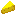
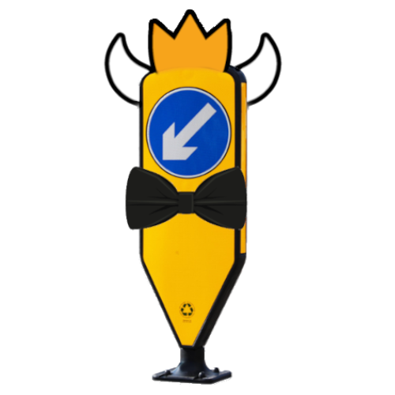

# Resource pack for HerdCraft server

Reasource pack for the HerdCraft MineCraft SMP server.

This is not inteneded to be used outside of HerdCraft, but feel free to take a look, since it can be used as an example for how to build your own resource pack.

## IDs

| Item             | CustomModelData | Alternative     | Model                                                                              |
| ---------------- | --------------- | --------------  | ---------------------------------------------------------------------------------- |
| pumpkin_pie      | 14170001        | cheese          |                         |
| pumpkin_pie      | 14170002        | cheese_pizza    |             |
| pumpkin_pie      | 14170003        | cheesewheel     |               |
| cooked_porkchop  | 14170004        | grilled_cheese  |     |
| carved_pumpkin   | 14170005        | santa_hat       |                                                                                    |
| totem_of_undying | 14180001        | penguin         |                  |
| totem_of_undying | 14190001        | totem_of_bobo   |      |
| totem_of_undying | 14200001        | moos_extra_life |  |
